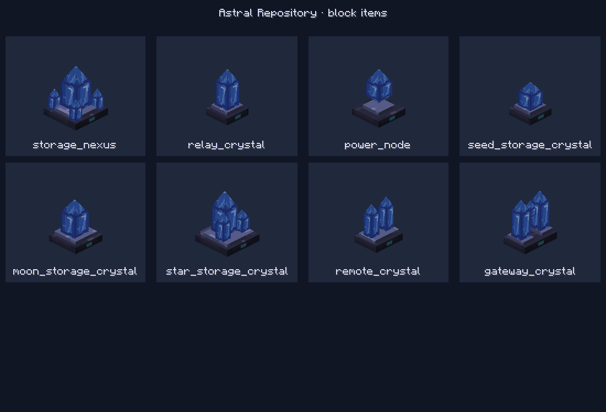

# Network block models

Eight network model sources are used at runtime: Storage Nexus, Relay Crystal, Power Node, Seed/Moon/Star Storage Crystal, Remote Crystal, and Gateway Crystal. Four retired model sources remain as artwork references. These `.bbmodel` files use Blockbench's Free Model format and were authored in Blockbench 5.1.6. [models.json](models.json) lists their model names, source filenames, and face counts.

Each source embeds the same four 16 by 16 textures. Their runtime copies are in [textures/block](../../src/main/resources/assets/astral_repository/textures/block/):

| Texture/material | Runtime treatment |
| --- | --- |
| `node_crystal` | `neoforge_TintIndex 0`: astral overlay over the original blue crystal artwork. |
| `node_channel` | `neoforge_TintIndex 1`: channel dye color, or teal when neutral. |
| `node_stone` | Untinted mineral base. |
| `node_trim` | Untinted trim. |

Both placed blocks and block items use these material assignments. The renderer selects the astral shader for tint index 0 and applies channel color only to index 1.



## Editing and export

1. Open the block's `.bbmodel` in Blockbench and keep its Free Model format. Save changes to this source, including embedded textures.
2. Export Wavefront OBJ with `model_export_scale` set to `16`. Sixteen Blockbench units become one block in the OBJ; preserve the origin, UVs, material assignments, and face winding.
3. Normalize the OBJ material labels before installing it. Blockbench exports `usemtl m_<textureUUID>` labels; use the fresh exported MTL's `map_Kd` texture filenames to remap them to the runtime names. For example, a material whose `map_Kd` names `node_crystal.png` must become `usemtl node_crystal`. Apply the same mapping for stone, trim, and channel materials.
4. Replace the matching `.obj` in [models/block/node_meshes](../../src/main/resources/assets/astral_repository/models/block/node_meshes/) and set its `mtllib` reference to `<id>.mtl`. Pair it with the existing runtime MTL, preserving its namespaced `map_Kd` values and `neoforge_TintIndex` lines. Do not substitute the unmodified generic MTL export.
5. Keep the block JSON's `neoforge:obj` loader and `flip_v: true`. Its blockstate references that model. The `<id>_geometry` item model inherits the block model; the public item inherits [item/network_node](../../src/main/resources/assets/astral_repository/models/item/network_node.json) for the custom renderer and display transforms.
6. Reopen the saved `.bbmodel` and inspect the exported OBJ after reimporting it. Confirm scale, winding, UVs, and material assignments, then update the face count in `models.json`.

Crystal faces keep their authored UVs, which place the original artwork's facet highlights across the crystals. Base, trim, and channel faces use one texture pixel per model unit (16 pixels per block). Thin cube faces sample a correspondingly narrow rectangle; non-crystal mesh faces use orthonormal in-plane coordinates so pixels keep their proportions. All UVs stay inside their 16 by 16 material tiles.

After changing base, trim, or channel geometry, run [remap_node_uvs.py](../../tools/remap_node_uvs.py) to update those UVs in the active Blockbench sources and matching OBJ files together. The tool preserves authored crystal-face UVs. `python tools/remap_node_uvs.py --check` verifies non-crystal texel scale, all atlas bounds, and source/export agreement without writing. The tool supports the current unrotated cube and mesh elements; rotated authoring elements require an export transform first.

Texture changes must be reflected in every source that embeds the shared image and in its runtime PNG. Keep model filenames aligned between source and runtime. Run [sync_node_crystal_texture.py](../../tools/sync_node_crystal_texture.py) after changing the network crystal PNG to update all twelve embedded crystal textures; `--check` verifies their agreement without writing. It does not replace the runtime artwork or change geometry, UVs, or natural crystals.

Restore or reexport the network block-model, blockstate, and public item-model assets from their Blockbench sources instead of recreating primitive geometry. Natural crystals and the supplied wand/orb artwork are maintained separately.

## Client preview

From the repository root, with the development dependencies already cached:

```powershell
.\gradlew.bat --offline --no-parallel -PnodeModels runClientSmoke
```

This dedicated model fixture writes screenshots, per-model measurements, and `result.txt` under `build/client-smoke/node-models/`. The development client stays muted and does not capture the operating-system mouse.

## Astral Goggles

[`astral_goggles.bbmodel`](astral_goggles.bbmodel) is a Java block/item model authored directly as model data. It contains 21 cuboids and embeds the user-reduced 57 by 56 pixel artwork on a 57 by 57 transparent canvas. The runtime geometry is [`astral_goggles_geometry.json`](../../src/main/resources/assets/astral_repository/models/item/astral_goggles_geometry.json). Only the gem lens faces have tint index 0, which selects the astral shader with 55 percent surface opacity. Open frames let the wearer show through the lenses. The public `resonance_goggles.json` item model supplies the custom renderer and display transforms. HEAD selects the armor geometry for vanilla and Curios equipment; other display contexts select the separate `astral_goggles_icon_geometry.json`, a 16 by 16 icon with one-pixel thickness and lens-only shading.

The original texture was generated with the built-in image-generation tool. The user supplied the reduced artwork; its pixels are preserved, with one transparent row added at the bottom. UVs stay inside the atlas's 29/28-pixel columns and two 28-pixel rows. Each face uses a model-space projection at 1.5 texture pixels per model unit, keeping adjacent lens/rim pieces aligned and avoiding stretched tiles on thin straps. Prompt: a four-quadrant Minecraft pixel-art material atlas with midnight-indigo metal, purple leather, blue/cyan faceted astral crystal, and muted lavender-silver trim; no text or rendered objects. Its runtime copy is [`astral_goggles.png`](../../src/main/resources/assets/astral_repository/textures/item/astral_goggles.png).

Run [finish_base_textures.py](../../tools/finish_base_textures.py) after importing reduced textures to remove faint pixels and normalize near-opaque artwork (alpha 240 or greater) and regenerate the armor UVs, embedded atlas, and hand-authored item icon. It preserves fully opaque source pixels. The icon reuses crystal patches from the atlas and its separate lens mask selects the shader.
