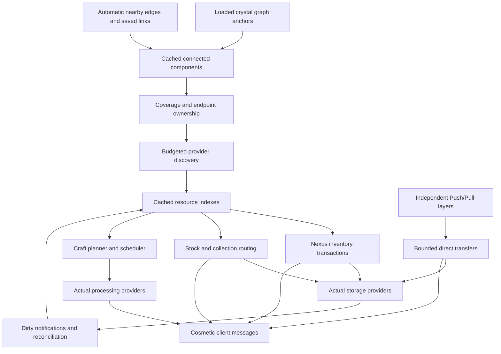

# Architecture

Astral Repository keeps authoritative resource state on the server. Clients receive inventory pages, diagnostics, and cosmetic transport messages. Visual entities and animation timing never own items or determine whether a transfer succeeds.



## Topology and endpoint ownership

`NetworkManager` owns server-scoped anchors, pending changes, spatial lookup, and network membership. An `AnchorAddress` identifies a dimension and block position; persisted rune addresses also include their outward face.

`NetworkManager` combines saved links with automatic edges among loaded Relays, Storage Nexuses, and Storage Crystals. Spatial buckets find neighbors on the same channel within `relayRange`; a second pass joins range-upgraded Relays within `remoteRange`. Same-dimensional edges also require loaded, unobstructed sight by default. All eligible edges remain available, including cycles. Automatic edges are recomputed rather than saved. Power Nodes and dimensional bridges still use explicit links.

`NetworkTopology` validates the resulting edges. Enabled endpoints must share a dye channel. Cross-dimension links require two range-upgraded, dimensionally attuned endpoints. Neutral is channel `-1`; it does not bridge dye colors. Changing a channel, disabling an endpoint, or unloading a chunk suspends its connections.

Every Nexus in one connected component uses the same `AstralNetwork`, inventory index, and crafting coordinator. Separate components remain separate even where their coverage overlaps. New Push/Pull assignments are directed container targets stored on individual layers; they are not graph edges and do not join networks.

Crystal coverage is a sphere of `coverageRange`. The owner is the closest crystal, then the one with higher priority, then the first deterministic address. A component can use ordinary coverage only when that selected owner belongs to it.

The manager still understands persisted rune-face graph anchors. A face in a component supplies its host's exact sided view for that component, with higher face priority and address order selecting between multiple faces. These legacy graph views have no surrounding coverage. Per-layer transfer filters do not restrict the Nexus's view of that host. Provider identity deduplication prevents multiple views of one backing store from adding the same inventory twice.

Placement, removal, channel changes, explicit link changes, and chunk events invalidate topology. A bounded validation queue also checks host identity. When rebuilding the graph, the manager reuses services whose anchor instances, settings, internal links, and nearby coverage competitors are unchanged. Only affected components close their old services and cancel active local jobs, returning virtual escrow through the crafting recovery path. Unaffected components retain their indexes and active jobs.

An unlinked crystal can still affect a nearby component by changing which network owns an inventory. Datapack reloads explicitly rebuild all services, since their recipe and datapack state must be refreshed.

`RuneSavedData` persists surfaces and graph links in `data/astral_repository_runes.dat` under the world save. Every current `RuneLayer` has its own UUID, Push/Pull mode, list of up to 32 target positions and faces, filter, stock limits, priority, enabled flag, and transfer counters. Old shared inscriptions migrate to independent layers without inventing a directed target. New placements obey the synchronized server `maxRunesPerFace` limit (eight by default, up to 64) and available face area. Existing active layers remain present when the limit is lowered. Older `ArchivedLayers` remain outside rendering and transfer scheduling; removing a visible layer promotes the next archived entry, disabled, when the configured limit permits it. The saved format preserves up to 64 layers.

Chunk unload removes active anchors and provider views while preserving saved surfaces, assignments, and graph links. It clears the cached host reference so reloading the same block entity is not mistaken for replacement. A loaded host that is missing or replaced removes its inscriptions and incident graph links. Removing one layer preserves its siblings; removing the last layer removes the surface. Production discovery and transfers check chunk availability and do not add chunk tickets.

## Independent rune transfers

`DirectRuneTransfers` runs before the manager's crystal-network work and works without a Nexus. A layer's host side and target side define its two endpoints. Push uses host → target; Pull uses target → host. Assignments require different backing stores, a shared supported resource type, and the same dimension. A route must be available before resources move.

The route finder tries direct travel within `wandBindingRange`, then Dijkstra search weighted by physical travel distance through loaded same-channel transit crystals. Endpoint-to-relay legs use `wandBindingRange`; crystal edges retain their own ranges. Unreachable targets pause before extraction. Routes use a cache bounded by 16,384 entries and 262,144 retained states, counting path points, relay instances, and chunk references. Warm routes reuse those references while checking live chunk status, removal, enabled state, and channel. Ticket demotion rejects a route even before the delayed chunk-unload callback. Topology rebuilds clear the cache. Searches inspect nearby spatial buckets for starting relays rather than sorting every loaded node. A second cache retains shortest-path trees for up to 8,192 origins and 262,144 total relay states. Queries for different destinations reuse that origin search, so scanning a large network does not run Dijkstra for every store. Shared single-relay trees also prepare on two worker threads from an immutable graph snapshot captured on the server thread. Pending work is bounded by 64 jobs and 262,144 estimated relay states; completed worker trees have their own 262,144-state bound. New origins can share those trees with weighted entry legs. Cold queries use an immediate server-side search when preparation is unavailable; ticks never wait for workers or postpone due transfers for them. The tree caches clear with topology, sight, and chunk invalidation; obsolete futures are cancelled, results are revision-checked, and selected routes still validate live relay state. Workers close when the server stops. Sight uses a separate 8,192-entry cache. Its visited chunks are tracked so ordinary block mutations can invalidate both caches immediately, including edits made by commands, pistons, and other mods. Same-block state changes with identical opaque shapes, such as furnace lighting, retain cached routes. Chunk load/unload also invalidates sight. The graph applies sight filtering before component construction; transfer operations revalidate reachability before changing inventory.

The scheduler checks every loaded, enabled Push/Pull layer each tick, in descending priority with rotating order among equal priorities. Each resource follows its own effective Cadence amount and interval; inventory reconciliation does not limit rune turns. Each layer retains its resolved rates and cooldowns. The scheduler captures shared server limits once per tick and recalculates rates only when those limits or the layer's settings change; edits retain elapsed cooldown time. Each endpoint retains up to eight provider views; each item poll examines at most 512 slots and each move considers at most 64 resource identities. Endpoint caches are bounded. Provider identity and position indexes target invalidation to affected views. Endpoint identity sets and positional notification fan-out are reused without merging new sets for every transfer; each mutation still invalidates immediately, including a second change after polling in the same tick. Unchanged versioned inventories and same-tick polls reuse their snapshots. Rune surfaces are indexed by position and chunk. Unlinked rune faces do not create storage indexes or crafting coordinators; explicitly linked faces retain their network membership.

A transfer applies that layer's filter, source reserve, and destination stock limit. Without a reserve or stock target, a single item provider can offer a bounded live identity hint instead of a counted snapshot. Rejected or unavailable hints fall back to polling; all extraction and insertion checks are shared between both paths. Native item handlers reuse primitive slot indexes and bounded lookup scratch; reentrant handler callbacks borrow separate scratch so nested transfers cannot corrupt an outer lookup. It simulates extraction and acceptance, then uses actual mutation results. It skips containers reserved by a crafting job. Confirmed changes invalidate other cached views sharing the provider identity, including Nexus indexes. Empty sources, full targets, stock limits, unavailable faces, and unloaded chunks produce per-layer status text.

Rune transfers support items, fluids, FE, and Source through their provider adapters. Container-to-container transfers do not draw network upkeep; aggregate network endpoints apply their normal filters and power costs. Each resource medium has its own cadence and server limits.

`RuneProgramming` handles placement, wand targets, and opening the clicked rune with any held item on the server. `RuneSettingsPackets` opens a short-lived session for one nearby layer. Every edit rechecks the token, layer identity, loaded host, player reach, numeric bounds, and referenced registry IDs. The settings panel captures matching held-item data when adding a rule or enabling exact matching. `RuneLayout` uses the same saved positions and configured size for rendering and hit selection, leaving gaps available for normal container interaction. Clients receive bounded snapshots for visible glyphs, Shift-only inspection icons, and selection outlines; client selection never authorizes a mutation. Jade and the built-in overlay use the same icon-row model and renderer.

## Discovery and inventory indexes

Each `AstralNetwork` maintains discovery cursors, dirty positions, storage identities, item and resource indexes, workstations, a bookshelf library, and a crafting coordinator. A crystal's coverage cube is scanned incrementally, and the coverage/ownership check rejects positions outside its sphere or assigned to another network. A rune initially queues its own host position rather than a surrounding scan.

Default global discovery is limited to 512 examined positions per server tick. The manager distributes that budget across networks. Storage providers deduplicate by their authoritative physical/backend identity, avoiding duplicate counts for shared chest or digital-network views.

`NetworkInventoryIndex<K,P>` stores provider contributions, total counts, and the providers containing each resource key. Updating a changed provider replaces that provider's contribution; unrelated providers are untouched. Search and Nexus page generation read this cache rather than walking live storage slots.

Reconciliation rotates through providers. The default manager budget is eight provider polls per tick, and built-in item-handler polls examine at most 512 slots per call. A completed snapshot is eligible for fallback reconciliation after `reconciliationTicks`, default 100 ticks. Large handlers can therefore take several calls to publish a complete snapshot. Dirty notifications make affected providers eligible sooner.

`StorageDirtyMixin` observes `BlockEntity.setChanged()` and schedules server-side provider invalidation. Block and chunk lifecycle events cover discovery changes. Capability validity checks and bounded polling remain necessary for handlers that bypass normal dirty hooks. Built-in views retain their discovered chunk and block entity, check live chunk status and block state on every operation, and reject retired instances. Capability invalidation still retires a view immediately; tile-less providers also check for newly added block entities. Bookshelf reconciliation examines one six-slot shelf every 20 ticks.

The cached index scales with distinct resource identities and their provider references. Component variants are distinct item identities. Unit tests exercise a synthetic 200,000-key index; this is not a measured server-TPS guarantee for a factory containing 200,000 live inventories.

## Transactions and routing

Nexus deposits and withdrawals execute immediately by default and update known counts. With `instantPlayerInteractions=false`, the menu defers a transaction for 20 ticks, keeps one pending action, and cancels it if the menu closes or its captured inventory state changes. Access, the bound Nexus, provider availability, and optional power are rechecked at commit. Transfer effects are cosmetic and keep their full travel duration when player inventory changes are instant.

Push/Pull runes apply their own filters, source reserves, and stock limits. Whole-network bindings use the network providers while excluding the rune host. Native Storage Crystals expose items, fluids, and FE; optional power adapters retain their separate resource contracts.

Push/Pull rune batches use `RuneTransitData` when `instantAutomaticLogistics=false`. Extraction transfers ownership to a saved flight with a due tick; arrival inserts into the actual destination. The queue groups flights by deadline and visits only due buckets. Stock checks include pending batches, but a provider's per-call acceptance limit does not serialize separate departures. Network-bound targets resolve to individual physical storage providers, each with its own route and deadline. Saved entries retain resource components, endpoint faces, network policy anchors and remaining travel time. Unloaded destinations wait without loading chunks; loaded destinations that reject a delivery trigger a source refund, with any remainder retained in `TransferRecoveryData`. Indeterminate provider commits stay in the non-replaying recovery journal. Changing the instant setting affects new departures without accelerating already scheduled flights.

Crystal-network routing runs every 20 ticks by default, or every tick with `instantAutomaticLogistics`; upkeep retains its 20-tick cadence. The instant setting also skips managed table and stonecutter waits, while physical furnaces and external machines retain their processing contracts. Provider inspection and transfer quantities have budgets; resource polling rotates rather than always starting at the first endpoint. `TransferVisuals` sends one bounded waypoint packet per flight. The client follows a continuous curve whose relay influence points stay within half a block of their relay centers, taking 20–100 ticks per leg based on distance. Nexus paths use `relayRange` for direct travel and endpoint attachment.

Simulation checks expected acceptance before extraction. Actual return values remain authoritative because another actor can change a machine between simulation and mutation. A failed provider is marked unavailable and logged while unrelated providers continue operating. An uncertain direct-rune mutation also pauses its layer.

## Recovery and ambiguous provider failures

`TransferRecoveryData` persists resource identity, quantity, source position, provider identity, and whether a commit outcome is uncertain. Confirmed resources that were extracted but could not be returned are retried against their source when it is available. The retry loop is bounded.

An exception after a third-party commit may leave an unknowable amount in that provider. Such offers are recorded as uncertain and are **not automatically replayed**. Restoring the full original offer could duplicate items or fluids. Reconciliation of an uncertain record requires checking the provider's real contents first.

`CraftRecoveryData` separately saves virtual job escrow and recoverable table ingredients. Actual furnace or modded-machine inputs stay in their block entities. See [Crafting](crafting.md) for reservation ownership, cancellation, and interrupted-session behavior. Neither recovery file is an atomic transaction log spanning third-party save formats.

## Power and extension points

`NetworkPower` is disabled unless `powerEnabled` is set. When enabled, it calculates periodic upkeep and per-operation costs, simulates allowed supplies, and preserves confirmed item/fluid fuel value as persistent credit on Power Nodes. Create stress uses capacity leases; it is not converted into stored FE.

`CompatibilityRegistry` discovers resource, storage, external crafting, and power providers at loaded positions. `ProcessingAdapters` creates adapters that supply recipe knowledge and operate actual machines. Datapack `ProcessingRules` describe supported single-input item-handler boundaries. The core references no optional mod classes during common initialization.

Provider callbacks and Minecraft world access run on the server thread. The generic planner, topology, index, and power arithmetic operate on ordinary Java data. Craft recipe indexing and dependency search run on bounded worker threads over copied snapshots; world access, ingredient predicates, inventory mutations, and processor callbacks remain on the server thread. Addons must preserve that rule and the ownership contracts in [Provider API](providers.md) and [Crafting](crafting.md).

## Operator diagnostics

Operators with permission level 2 can inspect a loaded crystal position:

```mcfunction
/astral_repository inspect ~ ~ ~
```

Run the command at the crystal or supply its exact coordinates. It reports network status, indexed item types, and total items from the cache. It does not alter channels, routes, filters, storage, or jobs, and it requires the position to be loaded.


## Crafting transfer origins

Reservation extraction records each actual supplying store without animating a trip to the Nexus. `CraftOrigins` tracks those locations alongside scheduler escrow. Starting a processor consumes matching location records and emits storage-to-processor flights. Completed or cancelled operations tag returned quantities with that processor's position. Final insertion uses that source position, so nearby storage receives products directly and distant storage uses the shortest relay route. The location records are cosmetic; existing escrow, processor ownership, and recovery journals remain authoritative. Interrupted jobs recovered without location records use the network origin as a fallback.


## Transfer presentation under load

`TransferVisualDispatcher` collects cosmetic offers on the server thread and flushes once at the end of each server tick. A per-dimension spatial observer index and a bounded route/audience cache avoid scanning every player for every repeated route. Observers near intermediate legs receive the same complete path. Each player has an independent bounded sample, so activity near another player does not consume their allowance.

Item data is copied only for retained offers. Selected entries are encoded once and reused across recipients. Byte budgets bound network output and temporary buffers; a separate encoding-work allowance stops repeated oversized item components from exhausting the tick. Station slots coalesce in latest-update order, with a reset signal when omitted updates could leave stale displays. Actual transfer commits, machine arrival timers, and inventory contents never depend on whether a visual was retained.

`WorldVisuals` uses a level-scoped local tick clock, integer age subtraction, and frame interpolation. Time-sync corrections cannot jump existing flights. Pause and tick freeze stop advancement. Active flights and detached trails have separate bounds; excess offers do not evict flights in progress. Trail emission rotates through the population rather than always favoring the first entries.

`PreparedTransferPath` resolves route points, spline tangents, and random offsets once. A frame samples a leg using binary search and creates only the resulting position vector. Rendering rejects distant and off-screen sprites, groups resource draws by atlas, and draws a fluid or energy circle as one quad with shader edge coverage. No server entity is created for an animation. See the [validation record](validation.md) for measured client and server workloads and their limits.


Full moving item models have a separate admission allowance. Additional item flights use `TransferItemSprites`, which flattens visible baked GUI faces into one atlas batch. It limits icon complexity to eight quads, caches up to 256 detailed meshes, retains bounded per-packet lookup data, and limits new identity/model/mesh preparation per frame. Custom or overly complex models use their particle artwork. Pending icon preparation does not delay real resource movement.


Direct-rune container views retain the loaded rune working set, bounded by the number of tracked runes and their maximum 32 targets plus host. Unused views expire after 200 ticks, with at most 256 removed per tick. Capability validity is still checked before use. Item identities and rune geometry for cosmetic payloads are resolved only after observer sampling admits an offer. The effect reuses the transaction's validated route, reversing it for Pull. Inventory slot reads, ingredient predicates, provider callbacks, simulation and commits stay on the server thread. Committed network item quantities update the affected key and its locations without rebuilding unrelated inventory entries.


Nearby ownership uses per-dimension chunk buckets and a 32,768-position cache, cleared by topology, settings, chunk and sight changes. Position indexes use mixed packed-coordinate hashes to avoid collisions in dense grids. Explicitly linked rune faces still validate enabled state and host presence before notifications. Rune presentation updates query nearby loaded chunks (or the single looked-at block without goggles or a wand) and retain the existing 64-block visibility range and packet limits.
