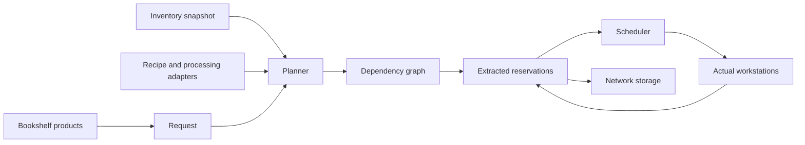

# Craft planning and processing

Right-click a Recipe Tome to open its book editor. Shift-click an output in the inventory below the book, or drag an item from EMI/JEI onto the page. The server resolves recipes for that exact item ID. Cycle alternatives with the arrows, inspect the ingredient preview, and select **Inscribe**. Samples are not consumed. Put the taught tome in a Chiseled Bookshelf inside network coverage. That final product appears in the Nexus crafting list. Intermediate recipes do not need additional tomes.

The server resolves the selected recipe and saves only its final output. The editor shows recipes with a fixed, enabled result; dynamic recipes without a fixed result are omitted. Browsing a recipe does not guarantee an available processing adapter or workstation. Requests still validate the network's actual processors and materials.

Requests produce the requested number of additional final items. Existing ingredients and intermediate items are used before resolving missing materials through available recipes and machines. Completed output and surplus return to network storage. If storage cannot accept a returned item, it drops at the originating Nexus when that chunk is loaded.

The Nexus accepts 1–4,096 additional final items per request, with up to 48 active requests per player. Right-click an empty craftable entry to request one item, or Shift-right-click any craftable entry to request its maximum stack size even when some are already stored. Middle-click selects an output for the quantity field and hammer button. Jobs appear at the lower right with their output, count, state, and progress; each active job has its own cancel control. The visible list contains only current work. Missing ingredients remain queued until supplied or cancelled; click a missing job to open its ingredient grid. Crafting does not send chat notices.

## Manual crafting grid

The Nexus grid uses actual vanilla crafting recipes. Taking a result refills consumed ingredients from network storage using the same item components. Container remainders occupying an emptied ingredient slot, such as empty milk buckets, return to storage before replacement ingredients enter that slot. A rejected remainder stays in the grid. Remainders from a slot that still holds ingredients follow vanilla inventory handling.

Shift-clicking the result crafts at most one maximum stack of output. Each complete recipe batch and any remainders that need inventory space must fit; insufficient space leaves that batch's ingredients untouched. The clear-grid control returns ingredients to network storage and leaves any rejected items in their original slots. Clearing an empty grid is silent.

Player transactions are immediate by default. With `instantPlayerInteractions=false`, transfers, crafting submissions, grid clearing, and refills wait twenty server ticks. Shift-crafting waits before starting its entire batch. Each menu permits one pending transaction; changing its inventory or cursor, losing access, becoming a spectator, or closing the menu cancels it before resources are moved.

## Available processors

| Processor | Execution |
| --- | --- |
| Crafting table, including Visual Workbench | Validates the selected recipe, arranges its ingredients on the visible 3x3 positions, and uses the recipe's actual assembly and remaining-item methods. |
| Furnace, blast furnace, smoker | Inserts actual ingredients and available fuel, waits for vanilla processing, and extracts the actual output. Existing burn time remains useful for later jobs. |
| Stonecutter | Validates and assembles a stonecutting recipe at a discovered stonecutter. |
| Create depot with mechanical press | Inserts a single ingredient into the depot. A mechanical press two blocks above it must perform the real pressing operation. |
| Create millstone | Inserts into its input slot and retrieves real results from its output slots. The millstone needs its normal rotational power. |
| Registered processing adapter | Runs through the adapter's actual machine or backend contract. |
| AE2 or Refined Storage crafting provider | If a local plan is unavailable, delegates an exposed final product to a discovered provider and polls its real ticket. Results remain in provider storage. |

Create adapters are optional and respect the `create` compatibility toggle. The shipped rules cover deterministic primary outputs with one item ingredient. Fluid-input recipes and recipes whose primary output is probabilistic are excluded. Chance-based secondary products are collected only when the machine actually produces them. Arbitrary Create assemblies and multi-input machine recipes need a dedicated `ProcessingAdapter`.

The Create item handlers, recipe accessors, and press offset were checked against the installed Create 6.0.10 JAR. GameTests have run both Create adapters against actual machines: a press produces an iron sheet and a millstone produces gravel through the full crafting service. The fixtures supply kinetic speed through a test-only API call; the real Create machine implementation performs each recipe.

## Planning

Requests enter the queue as `CALCULATING` before the next planning tick. Recipe adapters, component-sensitive ingredient matching, workstation discovery, and inventory snapshots run on the server thread. `AsyncCraftPlanner` builds its search index and calculates dependencies on two shared daemon workers with a bounded 128-task queue. It receives immutable recipe records and copied inventory/process sets, never a world or provider.

Each network reuses its catalog until recipe holders, processing rules, or stocked component variants change. Candidate lookups and relevant dependency keys are cached in that catalog. Up to 32 complete results are cached by output, quantity, inventory snapshot, and available processes. Repeated operations reuse these lookups without recursive stack growth proportional to batch size; backtracking remains available when a later input conflicts with an earlier choice.

The server rechecks recipe knowledge, processors, and actual reservation quantities before taking ingredients. Unrelated count changes do not invalidate an otherwise feasible plan. Missing jobs report ingredient alternatives and retain a recipe tag when that tag defines the choice. They retry after inventory or process changes. Cancellation discards unfinished futures; workers cannot reserve or move inventory.


`CraftPlanner<K>` takes a private inventory snapshot, immutable `CraftRecipe<K>` records, a target quantity, and the currently available process identifiers. It performs no world or capability access.

1. Reserve available ingredients in the planning snapshot. `planAdditional` always produces new final output; `plan` may satisfy the target from existing stock.
2. Resolve missing resources through supported recipes.
3. Try alternatives in descending explicit priority, then immediate material availability, estimated duration, and recipe ID order.
4. Backtrack earlier recipe and ingredient choices when a later branch needs a scarce material.
5. Record the producing node whenever a consumer uses an intermediate result.

The result is a topologically ordered `CraftPlan<K>`. Each operation records its selected ingredient alternatives and dependencies. Surplus from one operation can feed several branches. Existing ingredient stock produces reservations without extra intermediate craft nodes. A cycle rejects that production path while allowing other paths to be tried.

Search is bounded: the default planner allows 8,192 operations, recipe depth 128, 100,000 search steps, and 192 active search continuations. A request accepts quantities from 1 to 4,096, but a complicated batch can reach a search limit before that quantity. The failure message asks for a smaller batch. Recipe selection is a bounded search heuristic, not a global cost optimizer.



## Reservations and scheduling

`ReservationLedger<K>` prevents overlapping claims against a snapshot. Before execution, `CraftingService` extracts every required existing item and verifies the actual identity and quantity. A changed or unavailable inventory rejects the request and returns amounts known to have been extracted.

Successful extraction transfers ownership into job escrow. `CraftDelivery` reserves the chosen workstation and retains those inputs until their route durations elapse. Table previews populate each arriving batch before the final arrival starts assembly. Furnace fuel has a separate owned delivery and cannot burn in transit. Cancellation returns unconsumed in-flight resources once; already inserted machine contents follow the physical adapter's recovery rules. Instant automatic logistics skips delivery delays. Escrow is absent from the storage index, so another request or Nexus withdrawal cannot consume it. The temporary ledger claim can then be released.

`CraftScheduler<K,P>` tracks dependencies, a ready queue, running operations, and escrow. It only starts a node when all prerequisite operations have completed. Independent branches start concurrently, and separate furnaces or crafting tables provide parallel capacity. The common `parallelism` setting limits simultaneously active local operations across requests on a network.

A global workstation claim prevents two Nexus services from assigning the same machine. `NetworkAccess.processorChanged` invalidates indexed machine snapshots when ownership changes. Reserved machine providers must be excluded from storage extraction and routing until released.

With `instantAutomaticLogistics=true`, managed crafting-table and stonecutter operations skip Astral Repository's waiting time. Vanilla furnaces, Create machines, and external crafting backends retain their native processing time. The default is `false`.

Animations are cosmetic callbacks. Exceptions in transport or table animation callbacks do not change transactions or prevent job completion.

## Cancellation, failure, and saved recovery

Cancelling returns unconsumed escrow and completed intermediate items. An in-progress table operation returns its original ingredients. A furnace returns matching input or output still physically present. Fuel already consumed by the furnace is not recreated.

A broken or unloaded processor retains or drops its physical contents according to that block's normal behavior. Cancellation never creates replacement items for those contents. Some sided handlers, including the Create millstone input, do not permit extraction; their unfinished input stays in the machine. Removing or externally draining an active machine can therefore stop the request.

Active processing pauses when its chunk is unloaded. No processor operation force-loads chunks. Vanilla furnaces fail after a loaded-time stall of at least 1,200 ticks; datapack machine rules provide their own timeout. Waiting requests can be cancelled from the Nexus.

`CraftRecoveryData` persists virtual escrow and in-progress table ingredients in `astral_repository_craft_recovery.dat`. After an interrupted session, unclaimed saved escrow is returned when its originating Nexus service becomes available. Inputs already placed in a physical machine are saved by that machine instead. Normal shutdown cancels active local jobs. A topology rebuild cancels jobs only in components whose membership, settings, links, or coverage ownership changed; unrelated networks retain their services and active jobs. Datapack reloads force all services to rebuild.

If an insertion throws after an unknown amount may have committed, the offered items are recorded as uncertain and are never automatically replayed. Administrators must reconcile that record against the failed provider before restoring anything. The journal participates in Minecraft world saves; it does not provide an atomic transaction across third-party persistence systems.

External crafting tickets retain backend ownership. Cancelling a ticket calls the backend's cancellation API. Astral Repository does not recreate backend ingredients or copy backend output into another store. External jobs may continue in their own system after an interrupted server session; local ticket display is not persisted.

## Datapack machine boundaries

Define a single-item-input machine boundary at:

`data/<namespace>/astral_repository/processors/<id>.json`

The following is the built-in Create pressing arrangement expressed as a datapack override:

`data/astral_repository/astral_repository/processors/create_pressing.json`

```json
{
  "block": "create:depot",
  "above_block": "create:mechanical_press",
  "above_offset": 2,
  "recipe_type": "create:pressing",
  "input_side": "up",
  "output_side": "down",
  "input_slots": [0],
  "output_slots": [0, 1, 2, 3, 4, 5, 6, 7, 8],
  "timeout_ticks": 2400,
  "priority": 0
}
```

The referenced block and recipe type must exist in the installed pack. Sides use `down`, `up`, `north`, `south`, `west`, `east`, or `unsided`. Slot numbers refer to the capability exposed on that side, not necessarily the machine GUI's slot numbers. Omitted or empty slot lists examine every slot exposed by that capability.

`above_block` is optional; `above_offset` defaults to 1 and accepts 1 through 8. `timeout_ticks` defaults to 2,400 and accepts 20 through 72,000. `priority` defaults to 0 and accepts -10,000 through 10,000. A file containing `{"enabled": false}` disables a rule with the same resource ID, including a built-in rule.

These files describe where to supply and retrieve resources. They do not define free production. The adapter reads actual server recipes, requires empty relevant input/output slots, inserts one real ingredient, and polls declared output identities. It never calls recipe assembly to manufacture a machine result. The machine must perform processing through its own normal implementation.

## Java extension contracts

Register a `ProcessingAdapter` factory through `ProcessingAdapters.register(String, Supplier<ProcessingAdapter>)` during common setup, before networks are created. The factory creates separate adapter state for each network service.

An adapter supplies:

- `recipes(NetworkAccess)`: immutable planning recipes. Keep recipe IDs distinct across adapters.
- `supports(NetworkAccess, GlobalPos, CraftPlan.Node<ItemKey>)`: a read-only loaded-world capability check. Recipe-discovery probes have no selected ingredients.
- `start(NetworkAccess, GlobalPos, CraftPlan.Node<ItemKey>)`: either an accepted `CraftScheduler.Operation<ItemKey>` or `null` with no side effects when busy.

All adapter, world, inventory, and operation calls occur on the owning server thread. A successful `start` accepts ownership of the node's exact selected inputs. An exception may only be thrown before acceptance; an uncertain post-insertion outcome must remain claimed rather than trigger a fabricated refund.

An operation's `poll()` returns `null` while running. On completion, it transfers a map of actual owned results to escrow. `cancel()` transfers only resources the operation still owns. `recoverable()` reports virtual items held outside a persistent machine for the recovery journal. Returning the same item through more than one of these paths violates the contract.

External storage systems implement the separate `api.CraftingProvider` contract. Preserve `CraftingContext` across bridge calls and call `enter` with a stable provider identity. Repeated provider identities or excessive depth reject recursive requests. The current external-provider fallback serves final products; integrating external production as an intermediate requires a claim-aware processing adapter.

## Validation

`CraftingCoreTest` covers a fifteen-operation chain, cycles and alternate paths, scarce-resource backtracking across branches, shared intermediates, reservations, eight-way furnace scheduling, cancellation, unexpected results, and provider failure. It uses a pure scheduler fixture.

`CreateProcessingGameTests` exercises actual Create pressing and milling when the optional integration gate is enabled. `CraftingGameTests` exercises two actual vanilla furnaces consuming fuel and feeding a vanilla crafting-table recipe, checks the shaped visual ingredient positions, and verifies actual furnace-input cancellation. Automated visual callback checks do not substitute for observing the rendered animation in a client.
